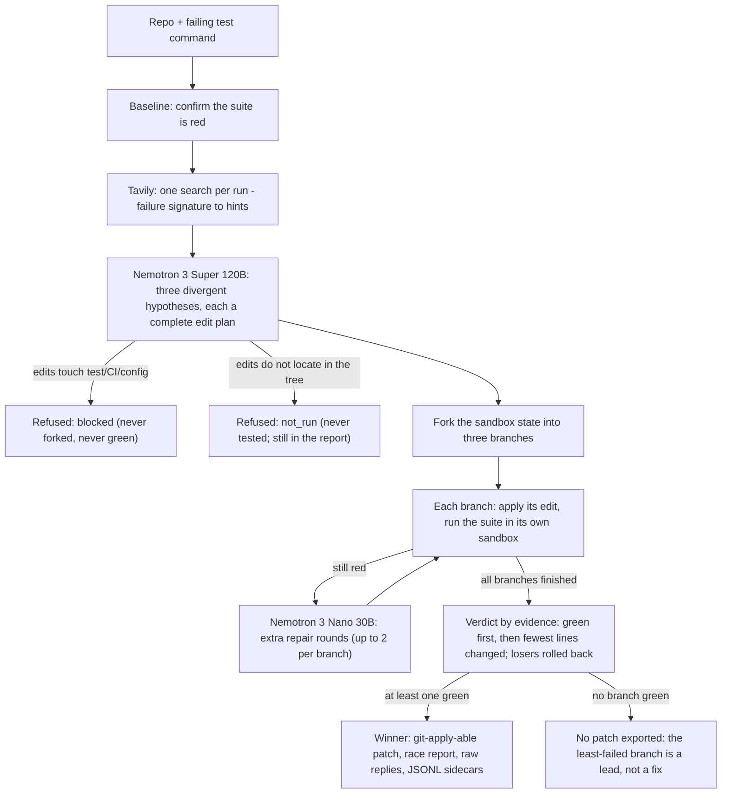

# FixFork

MIT licensed — see [LICENSE](LICENSE).

Give a repo and a failing test. FixFork forks three hypotheses, races them
on forked branches, and hands back the branch that passes — with evidence.
When no branch goes green, the report names the least-failed branch as a
lead, not a fix.

An autonomous debugging agent for the
[Nebius x NVIDIA Global AI Hackathon](https://nebiusglobalaihackathon.devpost.com/)
(Coding & Agentic Engineering track). It runs on Nebius Token Factory
with NVIDIA Nemotron models. Nemotron 3 Super 120B handles the diagnosis,
and Nemotron 3 Nano 30B runs the cheap repair loop. Before the diagnosis call,
a real Tavily web search grounds the failure signature.

Candidate fixes race on forked branches through a git-style sandbox
abstraction: checkpoint, fork, and rollback. A local backend is the default.
The Token Factory Sandboxes backend is wired and verified live end to end
(opt-in, `--sandbox nebius`).

> Status: early development. The notes below record what is wired and verified today.
>
> - The offline pipeline runs end to end. It uses a deterministic fake router and a local sandbox.
> - Live Token Factory model calls are wired and verified. On 2026-09-28, a full diagnosis and a 3-branch race ran on the demo repo, at about $0.003-$0.004 per run (rounded from $0.0029-$0.0042). The exported patch re-applied to a pristine checkout with `git apply`, and the tests passed.
> - Web grounding via Tavily is wired and verified. On 2026-09-28, a live run injected 5 real search results into the diagnosis prompt before proposing hypotheses.
> - A real external repository was validated on 2026-09-29: python-humanize (base commit 823ad60~1 plus the regression tests from PR #329). FixFork went from 6 failing tests to a winning patch. The exported patch re-applied cleanly with `git apply` outside the pipeline, on a pristine checkout as an unprivileged user in an isolated sandbox. The repository's own test suite then reported 310 passed. Three files were excluded, because their dev-only dependencies were absent from the sandbox. The run took about 7.6 minutes and about $0.026 in model calls, retries included.
> - The Token Factory Sandboxes backend is wired and verified live (2026-09-29). A full three-branch race ran entirely inside Nebius sandboxes. Baseline red inside the VM. Three branches forked from one state uuid, and the tests executed in the VMs. The winning 1-line patch was exported from the sandbox and re-applied with `git apply` on a pristine checkout (tests green). The race used 13 sandbox operations, measured $0.0044 in sandbox cost, and took about 102 s of wall-clock time, including the live diagnosis.
> - End-to-end sandbox result (2026-10-01): the same backend produced and verified the fix end to end, reproduced twice on the live OpenCTI #7778 case. Baseline red inside the sandbox VM (3 failed / 8 passed). The reply's three hypotheses shared one edit set (two duplicates dropped, one unique kept). The branch fixed all seven occurrences of the unguarded access and went green (11/11 tests). The exported patch re-applied on a pristine checkout (11 passed). 34/34 sandbox operations succeeded on each run.
> - Real-world result, merged 2026-09-30: a run against the live upstream issue python-poetry/tomlkit #619 (stdlib `fold` support) reproduced the failure and located the fix area. The run traces are public in `examples/tomlkit-619/`. Neither run finished the patch on its own. The final patch was completed and verified by hand from the run report: 10 source lines plus 2 regression tests. It passed tomlkit's own full suite (1,060 passed). The maintainer merged it into tomlkit master 66 minutes after the pull request opened ([PR #620](https://github.com/python-poetry/tomlkit/pull/620): +52/-1 across 2 files, 24/24 CI checks green).
> - Multi-site result (2026-10-01): a run against the live upstream issue OpenCTI-Platform/connectors #7778, a missing `classification` field in the greynoise connector. The third live run on the case fixed all seven occurrences of the unguarded access in one file on its own. All three branches of the race went green (11/11 tests). The exported patch re-applied cleanly on a pristine fixture (3 failed / 8 passed -> 11 passed). A fix for the same issue, completed by hand from FixFork's run report, is submitted as [PR #7821](https://github.com/OpenCTI-Platform/connectors/pull/7821) (signed commit, GitHub-verified; automated review recommends approval).
> - A further upstream case (2026-10-06, habit-hooks #129): dependencies declared in `setup.py`, `setup.cfg`, or a `Pipfile` were silently never checked. The red baseline was reproduced first (3 of 6 tests failing). Then all three branches of the race went green (6/6 tests on every branch). A fix for the case is submitted as [PR #200](https://github.com/habit-hooks/habit-hooks/pull/200). Its acceptance run, measured separately on the case's 7-test suite, goes from 4 failed / 3 passed to 7 passed, re-verified on a fresh clone. The commit `774a1c1` carries a GitHub-verified signature. No CI checks have run yet (first-time-contributor workflow approval pending).

## How it works



1. Baseline. Run the failing test and confirm it is red.
2. Web grounding (Tavily). Each run makes one real search call for the
   failure signature: the failing test plus the exception line. The top
   results are injected into the diagnosis prompt as hints. If the search
   fails, the run continues, and the report records an honest note.
3. Three hypotheses. Nemotron 3 Super reads the code, the failure log, and
   the web hints. It proposes three divergent root causes, each with a
   concrete edit plan. Files that the failure log points at are rendered
   first in the prompt. The prompt size caps are adjustable for repositories
   whose failing module outweighs the default budget (`--max-file-chars`,
   `--max-total-chars`). When the log names the failing access, for example
   a missing dict key, the prompt machine-scans every occurrence of it in
   the log-referenced files. A rule then requires each hypothesis to cover
   all of the occurrences. If no such signature exists, those files fall
   back to a larger budget instead of being dropped by the cap. An
   explicitly raised budget is never lowered by that fallback, and the
   total is raised to fit at least the per-file budget. Live evidence: a
   32k-char file was skipped, and all branches missed the other sites.
   Every hypothesis must also be a complete fix for its own explanation.
   Coordinated edits belong to the same hypothesis: a caller passing the
   value, the class accepting it, related methods staying consistent. They
   are not split across hypotheses. Live evidence: one multi-location fix
   split into three partial hypotheses left every branch red. The requested
   count is a target, not a hard filter. A reply that carries fewer complete
   hypotheses than requested (at least one) is raced rather than discarded.
   Measured: a complete 1-of-3 reply used to be thrown away by an
   exact-count check. Extra complete ones are deduplicated, then capped at
   the branch count. An empty or malformed reply is still rejected.
4. Fork and race. The sandbox state is forked into three branches. Each
   branch applies its edit when the edit is locatable, then runs the test
   suite inside its own sandbox. Locating uses an exact string match first,
   then two guarded fallbacks. A fallback is used only when the target is
   unique or clearly separated from the next-best non-overlapping candidate.
   The first fallback is a drift tolerance for blank lines and trailing
   spaces. The block's non-blank lines must still match the file. The second
   fallback is a near-miss rescue. It applies only the find -> replace delta
   onto the matched real-file window. It refuses any delta that rewrites a
   line the model's own copy slipped on. The default local backend uses temp
   dirs and no isolation. With `--sandbox nebius`, each branch forks a
   VM-level state image on Token Factory Sandboxes.
5. Cheap iteration. Branches that still fail get extra rounds from
   Nemotron 3 Nano, the small, fast loop model. Each branch gets up to two
   extra rounds, which keeps the repair cost low.
6. Evidence-based verdict. The score is tests green first, then fewest
   lines changed. The winning branch is selected, and the losing branches
   are rolled back. If no branch goes green, no patch is exported. The report then names the
   least-failed branch as a lead, not a fix. A branch that proposes edits to
   test, CI, or config files is refused before it runs (`blocked`). The
   test suite is the referee. A branch whose edits do not locate in the
   baseline tree is refused before it forks (`not_run`). It still appears
   in the report, marked `not_run`, but never as a branch that ran. Its
   approach was never tested.
7. Output. A self-contained race report in markdown (`--html` also writes
   a single-file page). It also stores the raw model replies for auditing.
   These include the diagnosis reply, and every loop reply in a
   `.loops.jsonl` sidecar when follow-up rounds ran. A per-call
   `.attempts.jsonl` sidecar is written whenever the live router ran.
   Failed retries are included, so the run's spend is auditable call by
   call. When a branch wins, the output includes a git-applyable patch of
   the winning fix (`git apply fixfork-report.patch`).

## What makes FixFork different

Instead of a single "suggested fix":

1. Three divergent hypotheses race in parallel. Each candidate fix runs as
   its own forked branch: git-style checkpoint, fork, and rollback through
   the sandbox abstraction. It is not a single edit suggestion.
2. The winner is picked by evidence, not guesswork. Green tests come
   first, then the fewest changed lines. Losing branches are rolled back, and the
   race report shows tokens and USD cost per branch.
3. The output is usable artifacts. A `git apply`-able patch of the winning
   fix, a self-contained HTML report, and the raw model replies for
   auditing. The test suite (`python3 -m unittest discover -s tests -t .`)
   runs 303 tests.
4. The referee is protected. Every proposed edit is checked before any
   sandbox work. Edits to test files, CI workflows, or build and config
   files are refused, and the branch is marked `blocked`. A blocked branch
   can never win or be suggested as a lead. `tests/test_race_replay.py`
   replays a recorded race where a test-editing branch used to score green.
   The branch is now refused, while the real fix still wins. Protected
   paths are matched case-insensitively: `Tests/` (as in Pillow),
   `__tests__/`, and `testdata/` all count. The exported patch is
   re-checked against the same list, so a renamed, quoted, or
   differently-cased protected path is withheld, not shipped. The refusal
   path (`fixfork/guard.py`) is exercised by 19 tests. In a 2026-09-29
   replay on Nebius Token Factory Sandboxes, the test-editing branch was
   blocked before any sandbox operation ran for it. The branch used 0
   operations in a 10-operation run. The two source-only branches then
   raced, and the winner's patch re-applied and the tests passed.
5. The diagnosis is web-grounded. Each run makes one real Tavily search
   over the failure signature, which seeds the hypothesis prompt with
   outside context. The model still has to produce exact-match edits that
   the tests verify. The search is a hint, never a verdict.
6. Grounded edits, not type guesses. The diagnosis prompt and the
   follow-up loop add one rule. Every call on an object produced by the
   repo must match evidence from the provided files. That evidence can come
   from test mocks or class definitions. The files that define the names
   imported by the failing files are resolved and rendered into the prompt
   (bounded, deterministic). A verification must read state that the system
   produced. An edit whose check passes only because it wrote the expected
   value into the returned object is fabricated, not verified. Measured
   failure and repair: 2026-10-05, mcp-atlassian #1578.

## How it uses Nebius & NVIDIA

- Nebius Token Factory serves every model call through its
  OpenAI-compatible API. The router tracks prompt and completion tokens,
  and USD cost, per branch. It writes a per-call `.attempts.jsonl` sidecar:
  every call, failed retries included, so spend is auditable call by call.
  It detects reasoning-budget exhaustion (`finish_reason=length`, empty or
  partial content) and retries with a doubled `max_tokens` (4096 -> 8192 ->
  16384 -> 32768).
- Nemotron 3 Super 120B (`nvidia/nemotron-3-super-120b-a12b`) is the
  diagnosis model. It reads the repo files and the failure log, and
  proposes three divergent root causes, each with a concrete edit plan.
- Nemotron 3 Nano 30B (`nvidia/NVIDIA-Nemotron-3-Nano-30B-A3B`) is the
  small, fast loop model. It runs extra repair rounds on branches that
  still fail, which keeps the race cheap.
- Token Factory Sandboxes is the live backend for isolating the three
  racing branches on Nebius infrastructure (opt-in: `--sandbox nebius`).
  Checkpoint, fork, and rollback are content-addressed state-image moves.
  A full race measured 13 operations and $0.0044 in sandbox cost
  (2026-09-29). On 2026-10-01, the backend produced and verified the fix
  end to end, reproduced twice. Baseline red in the VM. Three proposals
  collapsed to one unique edit set. The branch went green at 11/11, and
  the exported patch re-applied with 11 passed. 34/34 sandbox operations
  succeeded on each run.

## Web research (Tavily)

- Before the diagnosis call, FixFork runs one real web search per run.
  The search uses the Tavily Search API and targets the failure signature:
  the failing test plus the exception line. The top results are injected
  into the Nemotron prompt as hints. The model must still produce concrete
  edits that the tests verify.
- Access is keyless by default: no account, rate-limited. You can also set
  `TAVILY_API_KEY` to use an API key (identical response schema, free
  tier). Search results, the query, and source URLs are recorded in the
  run report.
- A failed search never breaks a run. FixFork records "web research
  skipped: ..." and continues without the section.
- A recorded run (report, patch, raw replies, event log):
  `examples/live-run-web-grounded/`.
- Probe the integration directly:
  `python3 -m fixfork research --query "python unittest AssertionError ..."`.

## Requirements

Python 3.10+ and `git` on PATH (to re-apply the exported patch; the
patch-export tests also exercise `git apply`). No third-party packages:
FixFork is standard-library only, so no `pip install` is needed. The live
router talks to Token Factory via `urllib`, and the Tavily search call uses
`urllib` too. Live runs need internet access: Token Factory plus Tavily.

## Quickstart (offline demo, no API key needed)

```bash
cd fixfork
python3 -m fixfork run \
  --repo examples/demo-repo \
  --test "python3 -m unittest discover -s tests -v" \
  --fake --out fixfork-report.md
```

The command runs the full pipeline against the bundled demo repo: a small
Python module with a planted bug. It uses the deterministic fake router and
the local sandbox. The output is a branch race report, a git-applyable
`fixfork-report.patch` with the winning fix, and, with `--html`, a
single-file HTML report.

Apply the winner anywhere and re-run the tests:

```bash
git apply fixfork-report.patch   # on a pristine checkout
```

## Quickstart (live, Nebius Token Factory)

```bash
export NEBIUS_API_KEY=...            # Token Factory key (never commit it)
python3 -m fixfork run \
  --repo examples/demo-repo \
  --test "python3 -m unittest discover -s tests -v" \
  --out fixfork-report.md
```

Live runs include one Tavily web search for the failure signature by
default. Keyless mode needs no extra key. Set `TAVILY_API_KEY` to use a
free-tier key, or pass `--research off` to skip the search.

To race the branches on Token Factory Sandboxes instead of local temp dirs:

```bash
export NEBIUS_API_KEY=...            # Token Factory key
export NEBIUS_SANDBOX_PROJECT=...    # Sandboxes project id
python3 -m fixfork run \
  --repo examples/demo-repo \
  --test "python3 -m unittest discover -s tests" \
  --sandbox nebius --out fixfork-report.md
```

`--fake` always keeps the local backend, so offline demo runs never call the
Sandboxes API.

The live router starts at `max_tokens=4096` and retries with a doubled
budget, up to 32768. This happens when a reasoning model spends the whole
budget thinking instead of answering, because reasoning tokens are billed
as completion tokens. Tokens and USD cost are tracked per branch in the
report. Every call, failed retries included, lands in a `.attempts.jsonl`
sidecar next to the report.

## Layout

```
fixfork/            package (pipeline, router, sandbox, judge, report)
tests/              unittest suite for the package
examples/demo-repo/ tiny buggy repo used by the offline demo
```

## Backends

| Piece | Offline (default here) | Nebius |
|---|---|---|
| Models | `FakeRouter` (deterministic fixtures) | wired and verified: Nemotron 3 Super 120B (diagnosis) + Nano 30B (loop) via Token Factory |
| Sandboxes | `LocalSandbox` (temp dirs, no isolation) | wired and verified: fork and rollback on content-addressed state uuids (`--sandbox nebius`); full race: 13 ops, $0.0044 (2026-09-29) |
| Web research | `FakeResearch` or `--research off` | Tavily Search — wired and verified (one call per run; keyless or free-tier key) |

## License

MIT — see [LICENSE](LICENSE).
